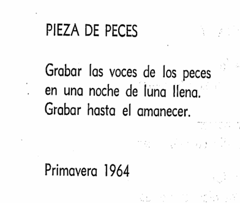
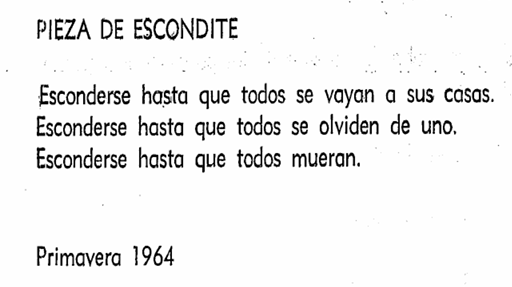
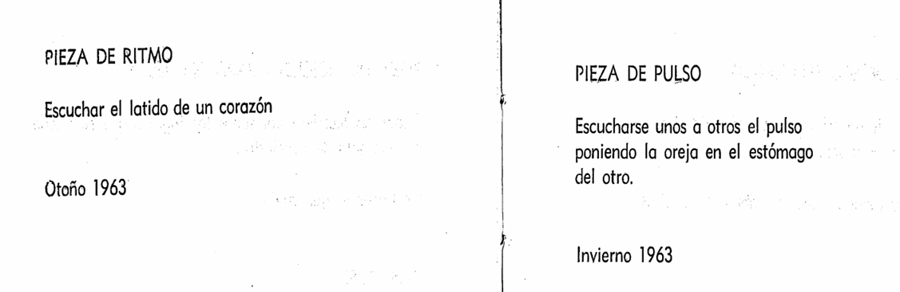
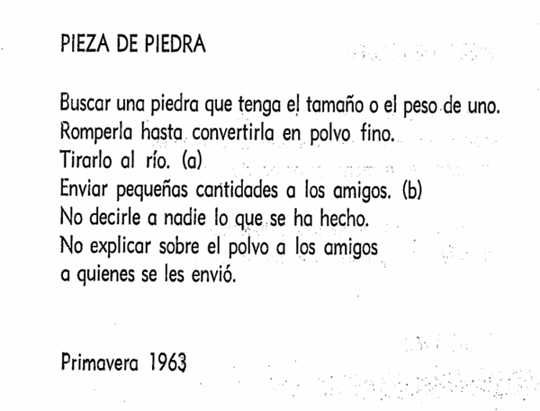
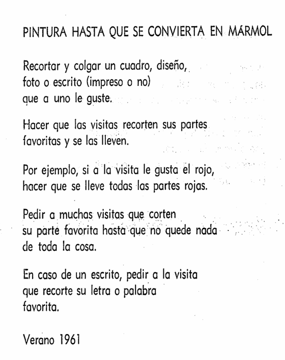
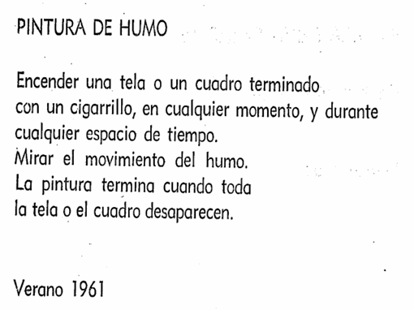
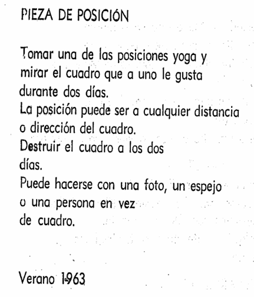
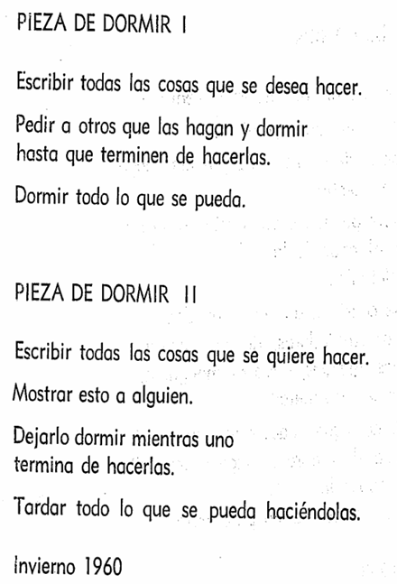
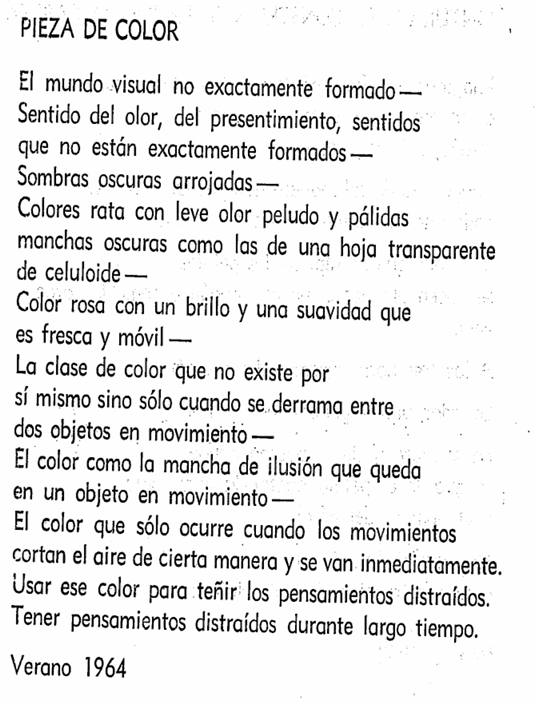

# sesion-13a

Martes 9 de junio

Para que el fabricante acepte el diseño, se debe incluir estas capas en la sección de Trazar:

1. `Edge.Cuts` — Contorno de la placa
2. `F.Cu` — Cobre superior
3. `B.Cu` — Cobre inferior
4. `F.Mask` — Máscara de soldadura frontal
5. `B.Mask` — Máscara de soldadura trasera
6. `F.Silkscreen` — Serigrafía/Texto frontal
7. `B.Silkscreen` — Serigrafía/Texto trasero
- Se crean archivos Gerber (.gbr) y taladrado (.drl) con el diseño de la placa.
- Se revisan en KiCad para comprobar contornos y agujeros	
- Se comprimen en .zip para fabricar.
- Fabricación (JLCPCB): Se sube el .zip, se revisa la vista previa y se eligen parámetros básicos.
- Carcasa/UX: Se diseña pensando en el usuario y se justifican decisiones. Referentes: Macumbista, Corazón Robota, Victor Mazón, Bleep Labs.
- Materiales: Uso de cajas (Hammond), perfboard, separadores o impresión 3D según el diseño.

---

Se votó mantener los grupos y ganó que sí. Luego explicaron que es obligatorio soldar 3 placas, definir una lista de materiales y proponer 2 partituras para una performance de 5 minutos con el sintetizador. 
Como grupo, evaluamos si hacer una carcasa o no, y decidimos no hacer una y usar placas de acrílico.

Por error, la serigrafía quedó en la capa User y no en F.Silkscreen, por lo que la PCB llegó sin el dibujo.

Para solucionarlo, pensamos en dejar la PCB suspendida con spacers y poner encima una plancha de vinilo semi-transparente con el diseño grabado, donde también irían los potenciómetros ˙ᵕ˙

## Partituras ◝(ᵔᵕᵔ)◜

### Idea 1

(ver literal) Como grupo 01 (las 5 personas) nos vamos a República 180, Santiago de Chile con "maincra" (piezo 01), el parlante estándar y un oscilador. Al llegar a la FAAD situamos "maincra" en uno de los hoyos de la muralla que soporta la escalera de cemento expuesto. Conectamos los piezos a escalones en distintos pisos y nos unimos a los estudiantes/profesores/funcionarios que estén subiendo o bajando la escalera. La idea es hacer sonar el oscilador a través de nuestro circuito (y el parlante). Esto duraría 5 minutos.

- Para mostrarlo a la comisión, pensamos transmitir por Discord, aunque idealmente que asistan para verlo y escucharlo mejor ˙ᵕ˙

(ver partitura) Dirígete a República 180, Santiago de Chile. Conecta los piezos a los escalones de cemento en la entrada. Únete al baile de los estudiantes y escucha tus pasos.

### Idea 2

Uno se pone el piezo en el cuello y sale de la sala (aprovechando el cable largo), caminando mientras grita o gruñe para activar las vibraciones. En un punto, el cable se tensa y el piezo cae del cuello. 

Aprovechamos para ir a República 180 para probar si funcionaba nuestra idea de la escalera.

## Lectura 

Me parece interesante cómo Yoko Ono transforma cosas mínimas o sillys en experiencias artísticas. Como que te obliga a parar, pensar y darle otro significado a lo cotidiano, rompe la idea típica de música. No hay instrumentos ni canciones como tal, sino acciones que igual podrían volverse música si las vives o las imaginas. 

Algunos de los que me parecieron interesantes del capítulo 1:

Algunos del capítulo 2:

