# sesion-14a

Martes 16 de junio

El día anterior recibimos las PCB, las cuales Aarón nos entregó durante la clase de Interacciones Inalámbricas. De las diez placas disponibles, nos llevamos cinco para repartirlas entre los integrantes de nuestro grupo ദ്ദി ˉ͈̀꒳ˉ͈́ )⊹₊⋆ ᡣ𐭩

Están super cutes todas, amé, fue muy emocionante verlas en persona jj

Luego durante la clase comenzamos la etapa de soldadura. Misa y Aarón nos dieron varias recomendaciones para facilitar el armado, como seguir un orden específico al soldar los componentes, comenzando por las resistencias, luego los condensadores y continuando con el resto de las piezas. También nos explicaron como pequeño tip, que la línea blanca presente en los condensadores polarizados debe coincidir con la marca indicada en la PCB.

Nos dedicamos a ordenar los componentes y entregárselos a Nico y Bruno, quienes estaban realizando las soldaduras. Más tarde, Benjamín y yo trabajamos en KiCad desde el computador, revisando la ubicación de cada componente y confirmando que todo estuviera correcto antes de indicar a Nico que podía proceder con la soldadura de las piezas („• ֊ •„)੭( • ᴗ - ) ✧

### Fotitos del proceso

> Foto compartida por Benjamín

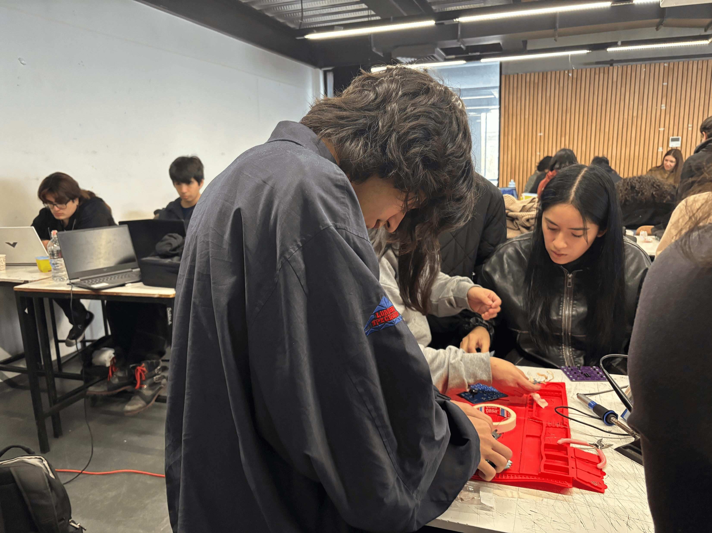

> Foto compartida por Benjamín

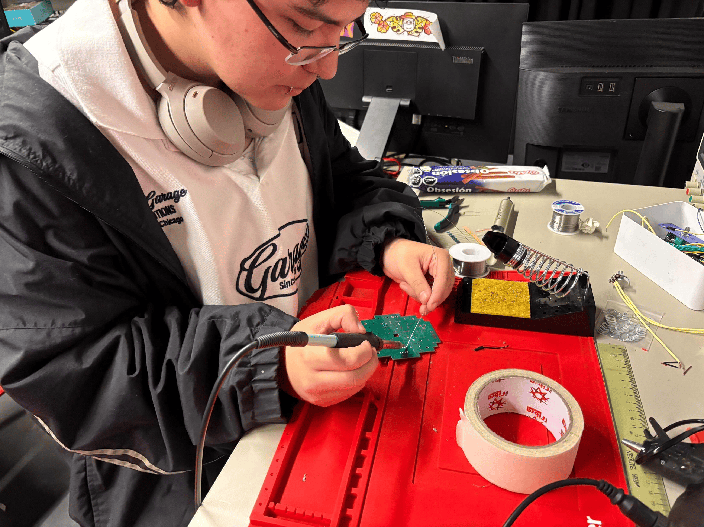

> pov ˙𐃷˙

> Foto compartida por Benjamín 

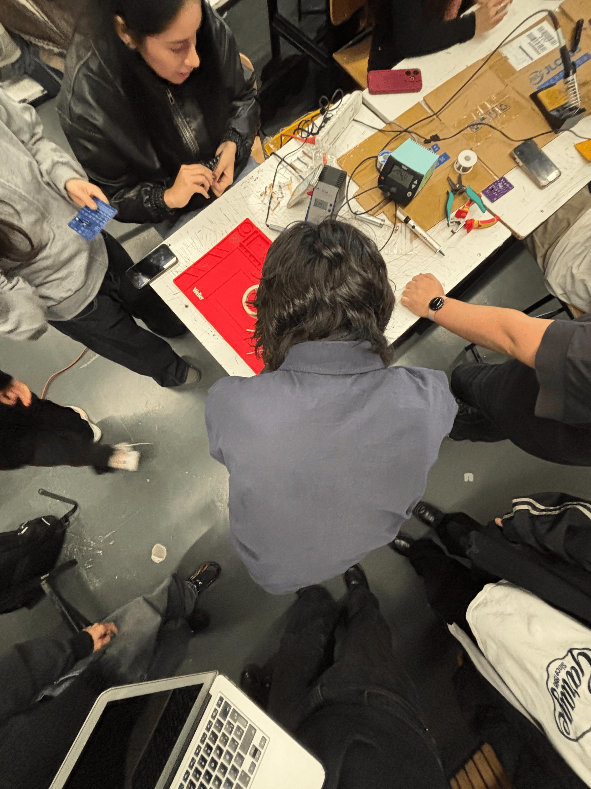

### Lectura

- Cap. 5 y 6

Los capítulos 5 y 6 son bastante cortos, pero me parecieron interesantes. Yoko Ono propone que el arte puede ir más allá de los objetos materiales y existir en acciones, sonidos, silencios o incluso en la imaginación de quien observa. Me llamó la atención cómo el espectador pasa a tener un rol activo en la construcción de la obra.

Algunos que me parecieron interesantes del cap.5:

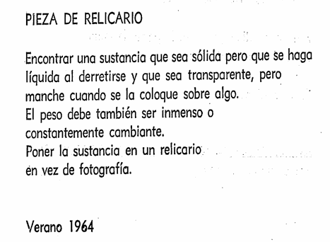

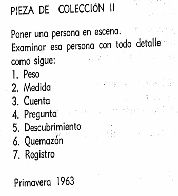

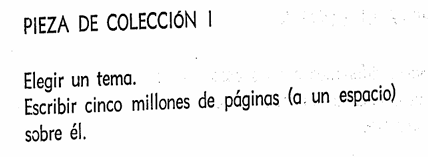

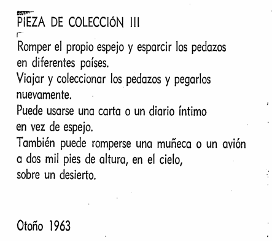

Y del cap.6:

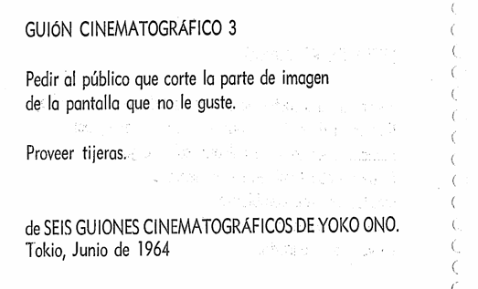

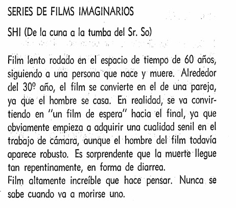

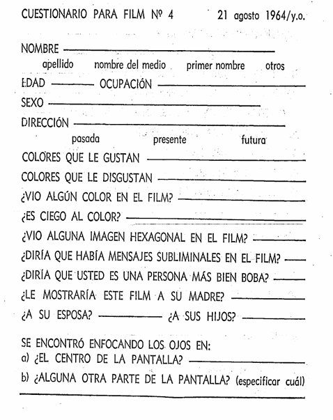

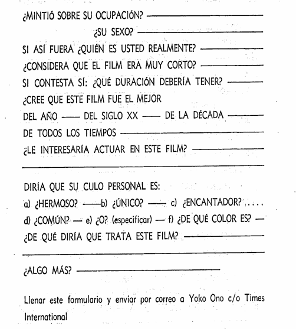
