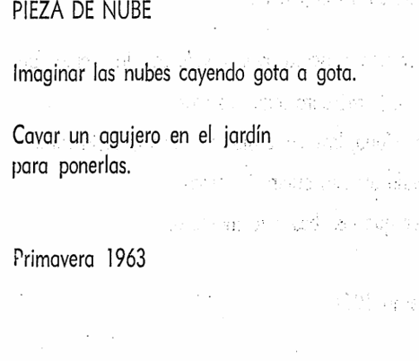

# sesion-13b
sesion 13b
## cap 3 evento
Una pieza que me llamó mucho la atención es la Pieza de nube. Dice que hay que imaginar las nubes cayendo gota a gota y cavar un agujero en el jardín para ponerlas. Es imposible de hacer, pero muy poética: convierte algo intangible en una acción concreta. Me gusta porque me obliga a pensar en cómo la imaginación puede transformar lo que parece inalcanzable.

 

Otra pieza,  la Pieza de reloj, (Me acuerda mucho a mi, siempre adelanto mis relojes) donde propone adelantar todos los relojes del mundo dos segundos sin que nadie se entere. Es una idea simple, pero poderosa: cambia el tiempo de manera invisible. Me hace pensar que el tiempo no es algo fijo, sino algo que se puede manipular y esa accion ya es arte.

 

son instrucciones que convierten gestos cotidianos o imposibles en obras. Hay piezas que hablan de caminar siguiendo un mapa inventado, de mostrar ropa sucia y contar su historia, de arrojar una piedra al cielo tan alto que nunca vuelva. Todas mezclan lo real con lo imaginario, lo posible con lo ilogico.

Lo que más me llama la atención es que Yoko Ono convierte cada acción en un evento artístico. No se necesita un escenario ni materiales especiales.

## Cap 4 Poesía

Una pieza que me llamó mucho la atención es un poema para ser leído con lupa. A primera vista parece algo muy simple: un texto tan pequeño que solo se puede leer con una lupa. Pero en realidad abre un mundo de interpretaciones. Me obliga a detenerme en la lectura, a mirar con cuidado, y me hace pensar que la poesía no está solo en las palabra. Se puede interpretar de distintas formas: como un secreto escondido, como un juego, o como una invitación a mirar lo invisible. Esa simplicidad me confundió al principio, porque es diferente y poco lógica, pero justamente ahí está su fuerza: en hacerme detener y pensar.
 
 

Otra pieza que me pareció interesante es dibujar círculo. Es como un formulario donde uno completa frases sobre si le gusta dibujar círculos y luego puede enviar el dibujo a Yoko Ono. Parece un juego básico, pero también abre interpretaciones: el círculo puede ser repetición, perfección, etc.. . Me gusta porque convierte un gesto mínimo en poesía y me recuerda que lo más simple puede tener muchos sentidos!!

 

Los poemas que parecen fáciles, pero que me confundieron porque son ilógicos o diferentes. Algunos parecen absurdos, otros muy cotidianos, pero todos me obligan a pensar más allá de lo normal. Yoko convierte cosas comunes en poesía.

Lo que más me llama la atención es que cada pieza, aunque parezca mínima, tiene un fin: no es un fin cerrado, sino abierto. escribe para que cada persona que lo lea  encuentre su propio sentido. Libree.
